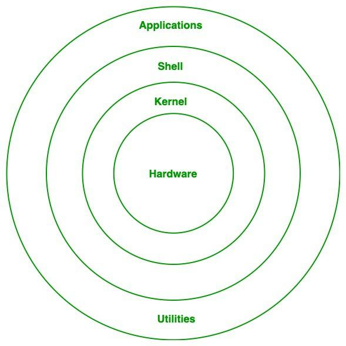
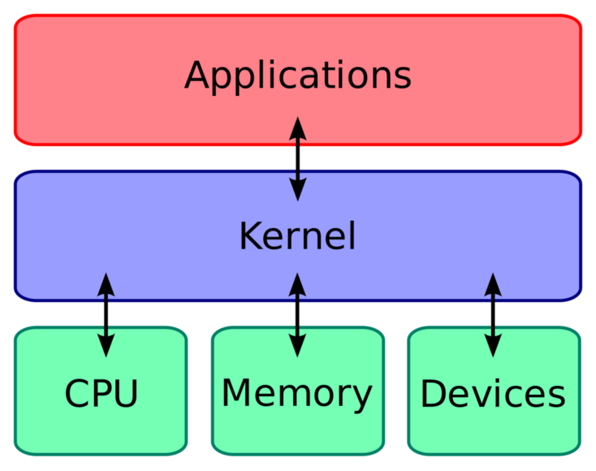

# Basic Architecture of Linux Operating System
- [Basic Architecture of Linux Operating System](#basic-architecture-of-linux-operating-system)
  - [Components](#components)
    - [Hardware](#hardware)
    - [Kernel](#kernel)
      - [Key Kernel Tasks](#key-kernel-tasks)
    - [Shell](#shell)
      - [Types of Shells](#types-of-shells)
    - [System Utilities](#system-utilities)
    - [Applications](#applications)
  - [Sources](#sources)

## Components
The main component of the Linux operating system are the Hardware, Kernel, Shell, Utilities, and Applications. These can be visualized in the image below:

### Hardware
The Hardware layer manages all hardware components such as CPU, memory, storage, etc. It includes device drivers, kernel functions, memory management, etc. [1](#sources)

The hardware layer interacts directly with the kernel [2](#sources).

### Kernel
Think of the kernel as the core of the Linux operating system. The kernel's purpose is provide an interface between hardware and processes:

#### Key Kernel Tasks
* Process Management
* Memory Management
* Device Management
* File System Management
* Network Management

### Shell
The shell is an interface between the user and the kernel. Users can execute commands and scripts in the shell. The shell obscures the internal functions of the kernel from the user.

#### Types of Shells
* **Command Line** - A terminal where text commands are executed.
* **Graphical User Interface (GUI)** - The interface is represented as interactive graphics for the user (think Windows, MacOS, etc.).

### System Utilities
Basic programs that provide basic functions for managing the system. 

These functions include: 
* **File Manipulation** - ls, cp, mv, rm
* **System Monitoring** - ps, top, df
* **Network Management** - ifconfig, ping
* **User Management** - useradd, passwd

### Applications
Programs that run on top of the kernel, providing specific functionality to the users. Applications can be text editors, browsers, network monitoring tools, and much more. 
## Sources
1. [Architecture of linux operating system](https://www.geeksforgeeks.org/architecture-of-linux-operating-system/)
2. [Linux Architecture: A Beginner's Guide](https://www.linkedin.com/pulse/linux-architecture-beginners-guide-anshul-agarwal-13kyc)
3. [Linux Guide - Linux Kernel](https://github.com/mikeroyal/Linux-Guide#linux-kernel)